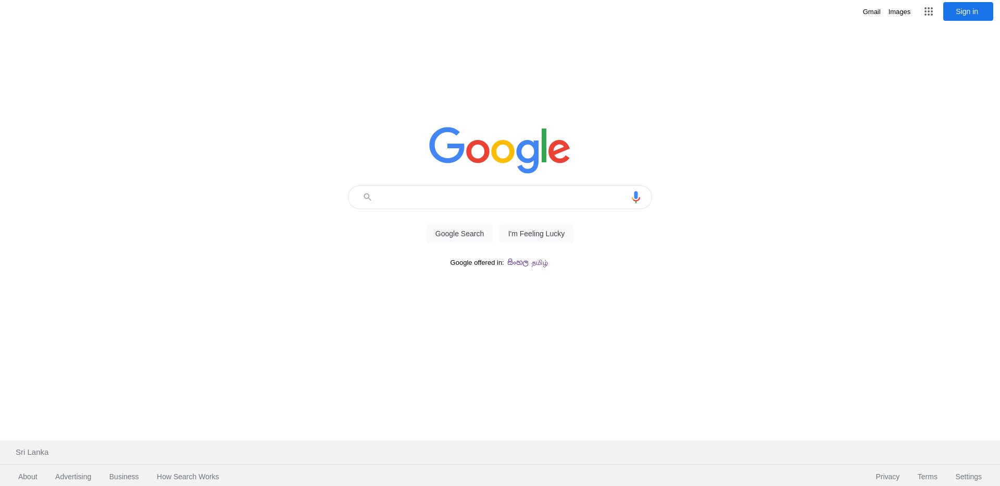
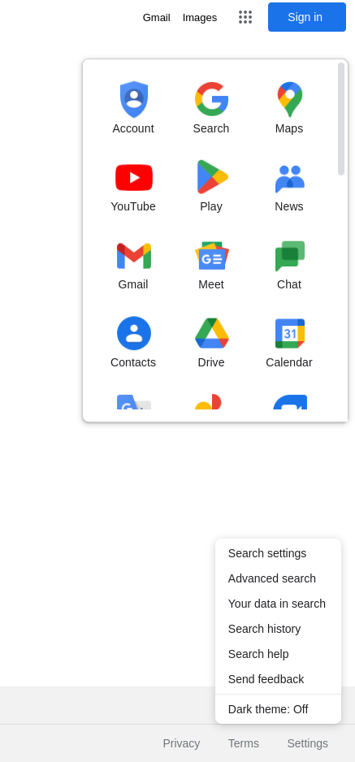
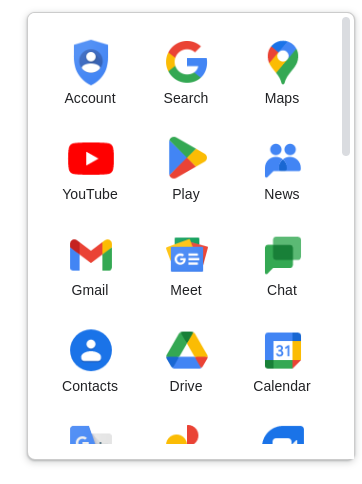

<!-- ABOUT THE PROJECT -->
# <b>About The Project</b>





<p>A clone web page of Google.com was created using HTML5 and CSS3. In this clone web site I mainly focused on using </p>


## Built with using

* HTML 5 
* CSS 3 
 


## How to use this repository

* Open the terminal
* Then clone the repo using 
```
git clone https://github.com/nipunsperera/boc-clone-website.git
```


<!-- CONTACT -->
## Contact

Nipun Perera - [@LinkedIn](https://www.linkedin.com/in/nipunperera96/)

Project Link: [https://github.com/nipunsperera/boc-clone-website.git](https://github.com/nipunsperera/boc-clone-website.git)


<!-- MARKDOWN LINKS & IMAGES -->
<!-- https://www.markdownguide.org/basic-syntax/#reference-style-links -->